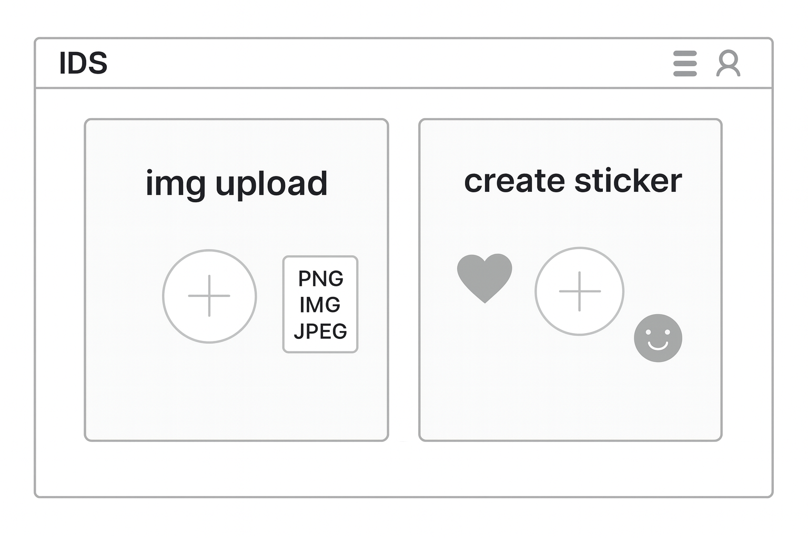

# ✨Image Deco Studio✨

## 📌 프로젝트 개요
요즈음, 인스타에서 유행인 
**사진에 스티커 꾸미기!** 🎨  

도전 해보고 싶으신데.. 복잡한 앱 사용방법 때문에 망설여지신다구요?

***~!!잘찾아오셨습니다!!~~***


복잡한 사이트가 아닌
본인이 원하는 스티커를 제작하여
**손쉽게**만드는것을 목적으로 웹사이트를 개발하고 싶다는 생각을 했습니다.

제가 똥손이라..... 손쉽게 사진을 꾸밀 수 있는 사이트가 필요했거든요!

**✨ 🎨 똥손도 예쁘게 자기 마음껏 꾸밀 수 있는! 사이트를 만들겠습니다!🎨 ✨**


---

## 🎯 개발 목적
요즘 많은 SNS 사용자들이 자신의 사진을 꾸며 개성 있게 표현하고 싶어합니다.  
하지만 복잡한 포토샵 도구나 앱 설치 없이,  
*브라우저에서 바로 꾸밀 수 있는 간단한 툴*이 많지 않습니다.  

이 사이트는 누구나 **간단히 이미지를 꾸미고 저장**할 수 있는  
웹 기반 도구를 목표로 합니다!  

---

## 🧩 주요 기능

### 1️⃣ 이미지 업로드
- 사용자가 자신의 사진 파일(JPG, PNG 등)을 선택하여 업로드  
- 업로드된 이미지는 편집 영역에 표시됨  

### 2️⃣ 스티커 선택
- 개발자가 미리 올려둔 “스티커 이미지”를 클릭하여 자유롭게 추가 가능  
- 크기 조절 / 회전 / 삭제 기능 포함  
- 스티커 카테고리 예시:  🎀 리본 /  감성 아이콘 / ✨ 반짝이 효과  / 등등...

### 3️⃣ 드래그 & 드롭 편집
- 마우스로 이미지를 끌어서 위치 조정  
- 여러 개의 스티커를 겹쳐서 배치 가능  

### 4️⃣ 결과 저장
- 완성된 이미지를 **캡처 후 다운로드 (JPG/PNG)** 가능  
- 브라우저 내 캔버스(Canvas) 기반으로 구현  

### 5️⃣ 나만의 스티커 업로드
- 사용자가 직접 만든 PNG 파일을 업로드해서 스티커로 사용  

---

## 🖥️ page 

```📂 image-deco/
┣ 📁 public/
┃ ┗ index.html
┣ 📁 src/
┃ ┣ components/
┃ ┃ ┣ Image.js ← 이미지 업로드 
┃ ┃ ┣ StickerList.js ← 스티커 목록 
┃ ┃ ┣ CanvasEditor.js ← 드래그·드롭 편집기
┃ ┃ ┗ SaveButton.js ← 결과 저장 버튼
┃ ┣ App.js
┃ ┗ App.css
┣ package.json
┗ README.md
```

---


## 🖼️ 주요 화면 (Wireframe)
아래는 IDS의 초기 메인 페이지 와이어프레임입니다.  
이미지 업로드와 스티커 생성 기능으로 구성되어 있습니다.


## 💡 추가 아이디어
- 스티커 카테고리 선택 필터
- 꾸민 이미지를 공유할 수 있는 링크 생성
- 배경색 변경, 투명도 조절 기능 추가
- 
---
## 🧠 제작 의도
 
“복잡하지 않지만 충분히 예쁜 결과물을 만들 수 있는”  
**가벼운 웹 편집기**를 직접 구현해보고자 합니다.

# 🌌 Image Deco Studio

> 누구나 손쉽게 이미지를 꾸밀 수 있는 웹 기반 이미지 데코레이션 스튜디오

---

## 🎯 프로젝트 목적

Image Deco Studio는  
**디자인 경험이 없는 사용자도 클릭 몇 번만으로 자신만의 이미지를 완성할 수 있도록**  
직관성과 사용성을 최우선으로 설계된 웹 애플리케이션입니다.

---

## 👤 타겟 사용자

- SNS용 이미지를 간단히 꾸미고 싶은 사용자
- 디자인 툴 사용이 어려운 비전문가
- 빠르게 결과물을 얻고 싶은 일반 사용자

---

## 🧩 핵심 기능 (MVP 기준)

- 이미지 업로드
- 스티커 선택 및 배치
- 드래그 / 크기 조절 / 회전
- 편집 상태 자동 저장 (localStorage)
- 결과 이미지 저장

---

## 📌 구현 범위 및 스코프 관리

본 프로젝트는 **학습 목적의 개인 프로젝트**로,  
기능 과다로 인한 완성도 저하를 방지하기 위해  
아래 기능들은 **의도적으로 MVP 범위에서 제외**하였습니다.

| 기능 | 상태 | 비고 |
|----|----|----|
| 나만의 스티커 업로드 | ❌ | 추후 확장 기능 |
| 스티커 카테고리 필터 | ❌ | UX 복잡도 증가로 제외 |
| 공유 링크 생성 | ❌ | 서버 필요 |
| 배경색/투명도 조절 | ❌ | 핵심 기능 아님 |

👉 **핵심 기능의 안정적 구현을 우선시한 스코프 조절 판단**

---

## 📱 반응형 및 접근성

- 모바일 / 태블릿 대응 반응형 레이아웃 적용
- 이미지 alt 속성 제공
- 키보드 삭제(Delete) 지원

---

## 🛠 사용 기술

- HTML / CSS / JavaScript (Vanilla)
- html2canvas
- LocalStorage

---

## 📈 향후 개선 방향

- 사용자 스티커 업로드 기능
- Undo / Redo 기능
- 접근성(ARIA) 강화
- 서버 기반 공유 기능

---

## ✨ 프로젝트 의의

본 프로젝트는 단순 기능 구현을 넘어  
**기획 → 스코프 관리 → 사용자 경험 → 완성도**까지  
전반적인 웹 프로젝트 흐름을 경험하는 데 목적이 있습니다.
